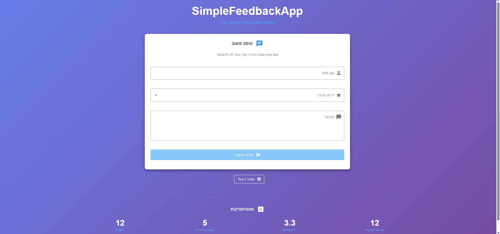
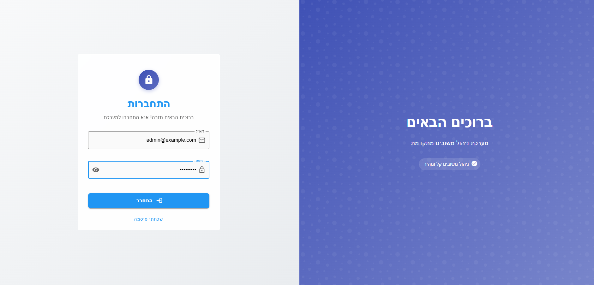
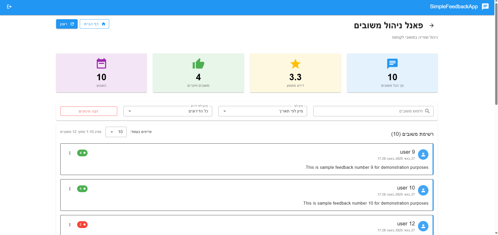

# FeedbacksApp

A simple and lightweight feedback management system built with:

- 🖥️ **Frontend**: Vue 3 + Vuetify 3 + Vite  
- 🌐 **Backend**: Node.js + Express  
- 🗄️ **Database**: MongoDB (Mongoose)

Users can submit feedback with a rating and message.  
Admins can view, filter, and manage feedbacks via a clean and responsive dashboard.

---

## 🚀 Getting Started

### 1. Clone the repository

```bash
git clone https://github.com/yberman8/FeedbacksApp.git
```

---

### 2. Frontend Setup (`client`)

```bash
cd client
npm install
```

Create a `.env` file in `client/`:

```env
VITE_BASE_URL=http://localhost:3000
```

Run the frontend:

```bash
npm run dev
```

---

### 3. Backend Setup (`server`)

```bash
cd server
npm install
```

Create a `.env` file in `server/`:

```env
VITE_BASE_URL=http://localhost:3000
SECRET_WORD=feedbackProjectDemo
PORT=3000
PORT_FRONTEND=5173
MONGODB_URI=mongodb://127.0.0.1:27017/simplefeedback
```

Run the backend:

```bash
node app.js
```

---

## ✅ Features

- Submit feedback with name, rating (1–5), and message
- Admin dashboard with search, filters, and statistics
- Responsive design (Vuetify)
- Demo admin user and 12 sample feedbacks auto-created on first run

---

## 🔐 Demo Admin

```bash
Email:    admin@example.com
Password: Admin1234
```

---

## 🧱 Tech Stack

- Vue 3
- Vuetify 3
- Vite
- Node.js
- Express.js
- MongoDB (Mongoose)

---

## 🖼️ Screenshots

```md



```


---

## 📄 License

This project is open for demonstration and educational use.  
You may reuse and modify it with credit to the author.

---

## 🙋‍♂️ Author

Developed by [Yossi Berman](https://github.com/yberman8)
